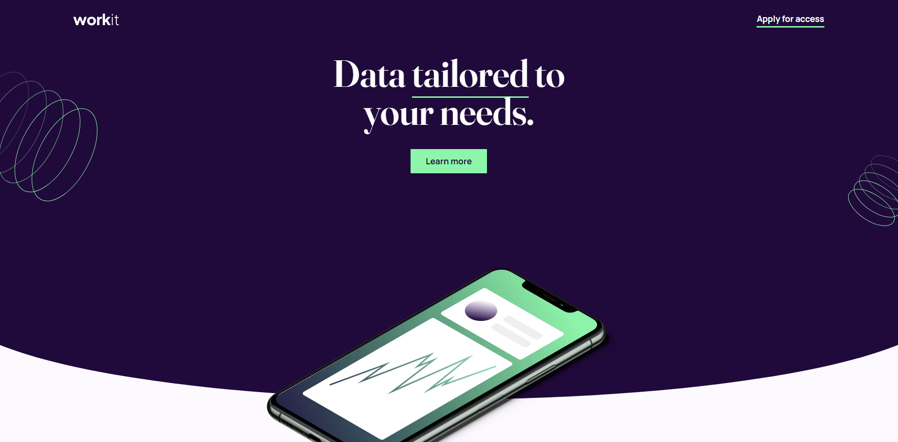
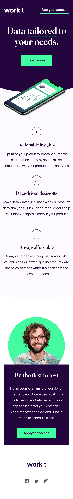

# 🐧 Workit Landing Page - Page Solution 

This is my first solution to the [Workit landing page challenge on Frontend Mentor](https://www.frontendmentor.io/challenges/social-proof-section-6e0qTv_bA) and took me 20 hours to complete. Frontend Mentor challenges help you improve your coding skills by building realistic projects. If you are a beginner you really need to try this!

## 📷 Screenshots

## 🎥 Live WebSite

- [Live site URL](https://alexandru-ghergu.github.io/workit-landing-page/)

## ✨ Technologies

- `HTML5`
- `CSS`
- `SASS`

## 🎢 What I learned

- First time using "SASS", here why 20 hours to complete the project.
